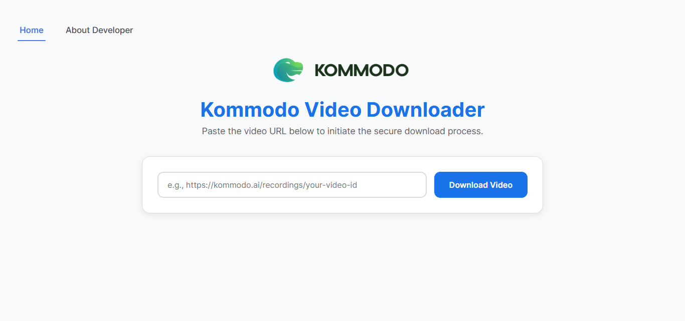

# Kommodo Video Downloader

A simple Cloudflare Worker project to download videos from Kommodo.  
The Worker receives a video URL from Kommodo, returns the video info, and allows downloading the video.




---

## Features

- Get video info from Kommodo URL
- Supports direct video URL, M3U8 playlists, and HTML pages
- Download video via browser
- CORS enabled for frontend usage
- Simple and lightweight Cloudflare Worker backend

---

## Folder Structure

```

kommodo-download/
├── README.md
├── back-end/
│   ├── wrangler.toml          # Cloudflare Worker configuration
│   └── src/
│       └── index.js           # Worker code
└── front-end/
├── index.html             # Main page
├── about.html
└── static/
├── script.js          # Frontend JS
├── style.css
└── images/            # Images and assets

````

---

## Setup

1. **Install Wrangler CLI** (for local development and deployment):

```bash
npm install -g wrangler
````

2. **Configure `wrangler.toml`**:

```toml
name = "kommodo-video-worker"
type = "javascript"
account_id = "YOUR_ACCOUNT_ID"
workers_dev = true
compatibility_date = "2026-03-16"

[vars]
ALLOWED_ORIGIN = "http://127.0.0.1:5500"
```

3. **Run locally**:

* Start Worker:

```bash
cd back-end
wrangler dev src/index.js
```

* Serve frontend (example using Python):

```bash
cd front-end
python -m http.server 5500
```

4. Open `http://127.0.0.1:5500` in your browser and test the downloader.

---

## Deployment

Publish to Cloudflare Workers:

```bash
wrangler publish
```

For production environment with different origin:

```bash
wrangler publish --env production
```

---

## How it works

1. User enters Kommodo video URL in frontend.
2. Worker fetches video info (direct link or playlist).
3. Frontend displays video thumbnail and download button.
4. User clicks download to save video.

---

## Notes

* Only works with Kommodo URLs that provide publicly accessible video links.
* Ensure `ALLOWED_ORIGIN` in `wrangler.toml` matches your frontend origin for CORS.
* The project is lightweight and meant for simple video downloading.

---

```

---

If you want, I can **also make a shorter “one-screen” version** of this README with only the essentials for quick setup — less than a page.  

Do you want me to do that too?
```
